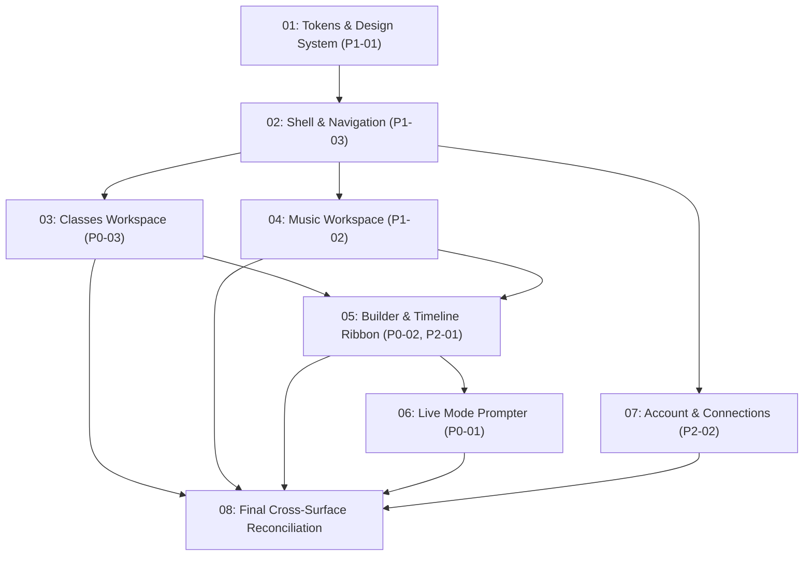

# Implementation Sequence & Prompt Order

**Audit Run ID:** gemini-design-audit-2026-07-24  
**Agent:** gemini  
**Baseline Commit:** 3cd14c6775b212c407c2fd8e39a55449410549ca  
**Approved Thesis:** Transform Ritmo Studio into a high-energy, athletic creator workstation that accelerates class building through fluid inline music discovery, clear timeline visuals, and a pressure-ready Live prompter.

---

## 1. Ordered Implementation Slices

| Order | Prompt ID & File | Scope & Backlog IDs | Rationale |
| --- | --- | --- | --- |
| 1 | `01-tokens-and-design-system.md` | `P1-01` (Tokens & Palette) | Establishes CSS custom properties, Kinetic Amber theme, and foundational utility classes used across all surfaces. |
| 2 | `02-shell-and-navigation-header.md` | `P1-03` (Persistent Navigation) | Constructs the unified top stage bar container before surface-specific views are wired up. |
| 3 | `03-classes-workspace-and-creation.md` | `P0-03` (Multi-Entry Building) | Implements the primary Classes workspace library, card components, and 1-click template creation flows. |
| 4 | `04-music-workspace-and-clip-preview.md` | `P1-02` (Music Substrate) | Updates `TrackSearch`, provider shelf components, and audio clip window preview auditioning. |
| 5 | `05-builder-workspace-and-timeline-ribbon.md` | `P0-02`, `P2-01` (Builder & Ribbon) | Builds the Energy Arc & Cue Anchor Ribbon signature inside `ChoreographyEditor` and track score views. |
| 6 | `06-live-mode-and-studio-prompter.md` | `P0-01` (Live Prompter UI) | Overhauls `LiveMode`, `LiveTimeline`, and `ClassPulse` for high contrast, large typography, and pressure safety. |
| 7 | `07-account-workspace-and-connections.md` | `P2-02` (Account & Connections) | Refines `AccountDialog` and `ConnectionsDialog` for persistent provider connection cards. |
| 8 | `08-cross-surface-reconciliation.md` | Final Quality Pass | Reconciles end-to-end user workflows, accessibility contrast, and visual regression gates. |

---

## 2. Dependency Graph

---

## 3. Ownership & File Collision Map

- **Slice 01 Owned Files:** `ritmofit_design_system/tokens.json`, `apps/web/src/styles/tokens.css`, `apps/web/src/index.css`.
- **Slice 02 Owned Files:** `apps/web/src/components/Dashboard.tsx` (Header & Nav shell).
- **Slice 03 Owned Files:** `apps/web/src/components/Dashboard.tsx` (`ClassesView`, `EmptyClassesView`, `ClassHeaderCard.tsx`).
- **Slice 04 Owned Files:** `apps/web/src/components/TrackSearch.tsx`, `apps/web/src/components/TrackPreview.tsx`.
- **Slice 05 Owned Files:** `apps/web/src/components/ChoreographyEditor.tsx`, `TimelineStrip.tsx`, `SegmentBand.tsx`, `CustomMovesDialog.tsx`, `SongsByMoveDialog.tsx`.
- **Slice 06 Owned Files:** `apps/web/src/components/LiveMode.tsx`, `LivePreflight.tsx`, `LiveTimeline.tsx`, `ClassPulse.tsx`.
- **Slice 07 Owned Files:** `apps/web/src/components/AccountDialog.tsx`, `ConnectionsDialog.tsx`.

*Collision Warning:* `Dashboard.tsx` is modified in Slices 02, 03, 04, and 05. **Run implementation prompts sequentially** or serialize commits to avoid merge conflicts.

---

## 4. Deferrals & Exclusions

- `PDR-01` (Inline Music Search in Builder): Deferred per solo-first creator focus.
- Dormant Explore, Teams, and Public Sharing surfaces: Excluded per D20/D21 rules.

---

## 5. Permissions Reminder

Implementation prompts authorise local code editing and testing. Commit, push, opening PRs, merging, and production deployment remain separate owner permissions.
