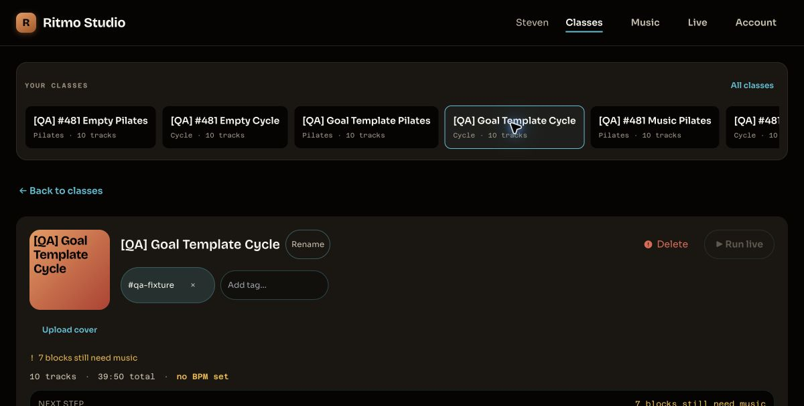
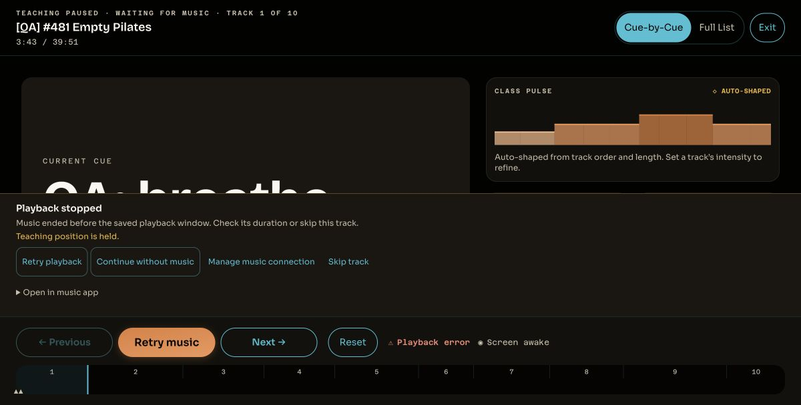
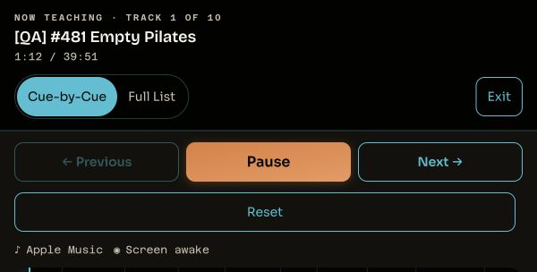
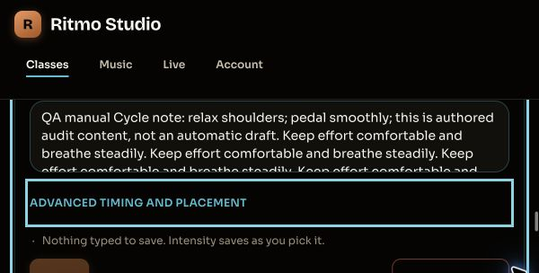
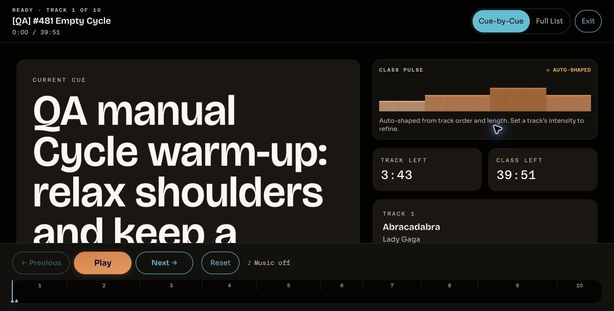

# Playlist-to-class-to-Live audit

Codex, 2026-10-03. Production desktop Chrome and Apple Music; Cycle and Pilates.
Success criterion: “I already built my playlist. Ritmo turns it into a class I can
confidently teach, and lets me add detail when I want.”

## Journey verdicts

| Journey                                | Verdict                          | Outcome                                                                                                                                                                   |
| -------------------------------------- | -------------------------------- | ------------------------------------------------------------------------------------------------------------------------------------------------------------------------- |
| Beginner Cycle, Classes template       | FAIL                             | Eight fixed 45-minute blocks. All ten playlist songs enter the first block; seven blocks remain empty and Run Live is disabled. No song cues or notes generated.          |
| Beginner Pilates, Classes template     | FAIL                             | Seven fixed 45-minute blocks. Ten songs enter Block 1; six blocks remain empty and Run Live is disabled. No song cues or notes generated.                                 |
| Beginner Cycle/Pilates, Music creation | FAIL desired teaching experience | Ten songs import in order and can reach Live, but there are zero teaching blocks, cues, moves, or notes. Guidance is “Lead this track,” not an editable discipline draft. |
| Experienced Cycle, empty class         | FAIL end-to-end; authoring PASS  | Quick import/Live works without choreography. Manual notes and two precise cues persist. Natural first-song transition fails.                                             |
| Experienced Pilates, empty class       | FAIL end-to-end; authoring PASS  | Same quick-start and detailed authoring capability. Manual current/next cues and notes appear in Live. Natural first-song transition fails.                               |

Manual QA content is separate Live evidence, not an automatic-builder pass.
Teaching-plan exercise guidance does exist in the Builder. It is not generated as
song cues/notes and is not projected as block guidance into the Live payload.

## Release and scope

Worker b74e4fe2-fbf3-4eb4-a617-ea6f45a04e03, 100% traffic; deployment
7e6129af-1a41-423d-825a-45e6ca9f8099. Three consecutive cache-busted SPA matches:
assets/index-68EE379w.js at 16:44:31 UTC. Browser entry matched then and at the
final check. Application source association from the prior release record:
d026f5992b8c2181b262259e5d9acf84e7745364 (#481).
See [release identity](./evidence/release-identity.json) and
[HISTORY](../../../ritmofit_dev_plan/HISTORY.md). Read-only full-close reconciliation
at 17:11 UTC retained the same Worker/SPA identity, no pending remote D1 migrations,
and passing route/header smoke; see [close reconcile](./evidence/close-reconcile.json).

Reused retained released-build import/recovery and prompter-only evidence, then
added scoped current API reads, fresh template imports, current Music entry
inspection, detailed editing/reload checks, and music-backed Live smokes.
No offered update prompt was present during resumed checks. Sign-in/preflight and
served identity were rechecked. Default desktop viewport was 1200 × 608 CSS pixels;
real Chrome 200% zoom produced 600 × 304. Zoom restored to 100%.

No iPhone, Spotify, HIIT, large-playlist import, source-playlist edit, deletion,
application-code/schema/config edit, commit, push, or deployment in this audit.
Only tagged audit QA classes were modified. Unrelated .claude/ work preserved.

## Entry points and effort

| Route                       | Decisions and principal activations                                                                                                                                                    | Friction                                                                                                                                                                                    |
| --------------------------- | -------------------------------------------------------------------------------------------------------------------------------------------------------------------------------------- | ------------------------------------------------------------------------------------------------------------------------------------------------------------------------------------------- |
| Classes → teaching template | Name, discipline, optional duration; 45-minute default. Eight activations: Start a class → discipline → Create → Choose music → Apple Music → Saved playlists → playlist → Import all. | “Ritmo lays out the blocks. You add the music” puts a fixed plan before the instructor’s intended playlist flow. Import all targets one selected block.                                     |
| Classes → empty             | Name, discipline, optional duration. Same eight principal activations, substituting Start empty/Add music.                                                                             | “You build the run of show yourself” understates quick import/Live and provides no quick teaching-draft action.                                                                             |
| Music → playlist → create   | Four activations for default Cycle: Apple Music → Playlists → playlist → Start class. Pilates adds its discipline activation. Playlist name becomes class title.                       | Shortest route. “New class template” chooses discipline without teaching generation. “Start class” creates/imports into Builder, not Live. No playlist search shown in saved-playlist list. |

Counts start on the named landing page and exclude typing, QA tagging, retries,
and individual keyboard events. Fresh template creation through first post-import
capture: Cycle 68.110 seconds; Pilates 72.636 seconds, including QA tagging and
inspection. These are agent-paced timings, not human usability benchmarks.
Prior Music/empty creation timings are UNVERIFIED because no elapsed timer was
retained. Their functional evidence is reused; no invented timing estimate.

## Material-check ledger

| Check                                                 | Verdict                                                                          | Evidence / limitation                                                                                                                                                                                                                                                           |
| ----------------------------------------------------- | -------------------------------------------------------------------------------- | ------------------------------------------------------------------------------------------------------------------------------------------------------------------------------------------------------------------------------------------------------------------------------- |
| Ten-song source membership and order                  | PASS                                                                             | Six fixtures match source occurrences, positions 0–9. current-fixtures.json, final-fixtures.json, source captures.                                                                                                                                                              |
| One song → one block, first/last warm-up/cooldown     | FAIL                                                                             | Fixed eight/seven scaffold blocks or zero Music-created blocks; no playlist-derived draft.                                                                                                                                                                                      |
| Automatic discipline cues and notes                   | FAIL                                                                             | Empty generated cues/notes in API/UI. Manual QA content clearly identified.                                                                                                                                                                                                     |
| Repeated songs and concurrent out-of-order resolution | PASS automated release regression evidence; UNVERIFIED real-provider repetitions | Tests preserve A/B/A occurrences and order across resolve batches. Real playlist has no repeats; source untouched.                                                                                                                                                              |
| Partial retry, stale destination, concurrent import   | PASS automated release regression evidence; UNVERIFIED production race injection | Ordered-import and integration tests cover retry in place, conflicts, atomicity, and replay. No fresh browser race or partial provider failure injection.                                                                                                                       |
| Lost committed response → reload recovery             | PASS retained production evidence                                                | Real successful response was discarded after commit in prior test. Reload/confirmation retained exact ten placement IDs and one receipt. Direct replay network-body comparison was not retained. prior-unconfirmed-import.jpg, prior-reload-confirmed.jpg, prior-fixtures.json. |
| Optional choreography versus requirements             | PASS empty/Music; FAIL desired template shortcut                                 | Cues/moves/BPM optional for empty/Music classes. Scaffold empty/overfilled blocks gate Run Live; this is current policy, not proof playback is impossible.                                                                                                                      |
| Notes, two cues, precise editing, both disciplines    | PASS manual authoring                                                            | Cycle 0:00 long cue and 0:15 → 0:17 edited cue; Pilates 0:00 and 0:15 → 0:16 edited cue. Notes/cues survive reload and API reads.                                                                                                                                               |
| Clip validation and duration                          | PASS with zero-anchor defect                                                     | End-before-start and clipping away existing cue rejected without changing saved data. Blank start + 0:30 end saves 30,000 ms window. Notes/cues retained; full source window restored.                                                                                          |
| Explicit 0:00 clip start                              | FAIL                                                                             | Rejected; blank start succeeds. clip-zero-rejected.jpg; positive-duration parser used for valid zero anchor.                                                                                                                                                                    |
| Duration presentation                                 | PASS display rounding; FAIL provider end reconciliation                          | 39:50.720 floors to 39:50 in Builder and shows 39:51 in Live. Not corrupted data. First track saved 223,398 ms; SDK reports 223 seconds.                                                                                                                                        |
| Detail → simple overview / disclosure                 | PASS                                                                             | Overview, Advanced collapse/expand, and Full List preserve authored data.                                                                                                                                                                                                       |
| Keyboard/focus                                        | PASS bounded checks                                                              | Initial title focus, discipline activation, Enter save, Tab/Enter disclosure, native Space Pause/Resume, Right seek, End completion. Cyan 3 px focus observed. Not exhaustive accessibility certification.                                                                      |
| Long text                                             | FAIL glanceable cue view; PASS retention                                         | Long cue requires extensive scrolling and separates current/next. Full List retains entire content. Not total text loss.                                                                                                                                                        |
| Authoring at 200%                                     | PASS sampled controls                                                            | No horizontal document overflow; notes/disclosure reachable with visible focus. authoring-200-focus.jpg.                                                                                                                                                                        |
| Live at 200%                                          | FAIL                                                                             | Teaching scroll region clientHeight 0, scrollHeight 2166; scroll attempt leaves scrollTop 0. Header/transport consume viewport.                                                                                                                                                 |
| Preflight and preparation                             | PASS four music-backed classes                                                   | Browser authorization check enables Start; teaching clock waits for actual provider progress. Availability/audibility claims remain separate.                                                                                                                                   |
| Current/next guidance                                 | PASS manual; FAIL automatic                                                      | Manual Pilates cues advance at 0:15 and notes show. Cycle manual content projects after reload. Other tracks show title/“Lead this track.”                                                                                                                                      |
| Pause/Resume                                          | PASS sampled provider transport                                                  | Pause: SDK state 3/time held. Resume: state 2/time advances. Both disciplines and Music-created routes checked; native keyboard Space works.                                                                                                                                    |
| Explicit transition / keyboard seek                   | PASS sampled runs                                                                | Next/Skip prepares next song, then SDK progress resumes. Right seek re-prepares and resumes.                                                                                                                                                                                    |
| Recovery                                              | MIXED                                                                            | Cycle retry at failed boundary repeats error: FAIL. Skip: PASS. Pilates Continue without music advances to next track: PASS prompter recovery.                                                                                                                                  |
| Accelerated completion                                | PASS                                                                             | End reaches Track 10/Complete in both disciplines and both Music-created fixtures. Not natural class completion.                                                                                                                                                                |
| Natural uninterrupted Cycle                           | FAIL                                                                             | First song progresses then ends at 3:43 with Playback stopped. Remaining natural full-class completion BLOCKED by observed defect.                                                                                                                                              |
| Natural uninterrupted Pilates                         | FAIL                                                                             | Same first-song failure. Provider duration captured during playback. Remaining natural completion BLOCKED. No shortening counted as pass.                                                                                                                                       |
| Audible music                                         | UNVERIFIED                                                                       | Listening confirmation requested; none received. SDK progress/Chrome audio indicator do not establish audible output.                                                                                                                                                           |
| Console                                               | PASS bounded capture                                                             | 48 errors captured, all extension-context errors, excluded from product findings. No app/provider console error in captured set; UI playback failures remain authoritative.                                                                                                     |

The automation snapshot retained stale Pause/Next names. Native Chrome AX and
actual DOM attributes contradicted those names: excluded from product defects.
An apparent Complete/Waiting contradiction was also not independently verified;
fresh native AX/DOM showed Complete, Playback ended, and no waiting status.

## Ranked findings and fix sequence

1. P1: Natural Apple Music end stops teaching. Reproduce with either Empty QA
   class: Run Live → browser authorization check → Start → no transport input.
   Abracadabra reaches 3:43 then “Music ended before the saved playback window.”
   Saved 223,398 ms versus MusicKit duration 223 seconds is strong causal evidence.
   runtime.ts:538–575 uses strict position < window.endMs; apple-music-adapter.ts:
   286–298 derives ended position from SDK duration. Recommend bounded boundary
   reconciliation while still failing truly early endings. Regression cases:
   subsecond duration, exact boundary, clips, final track, true early end. Then
   repeat full natural classes with listening confirmation. No schema/API need.
2. P1: Live hides teaching content at desktop 200% zoom. Reproduce normal 1200 ×
   608, then Chrome 200%. Fixed header/footer leave zero teaching height. Make
   layout height-aware and teaching content reachable, then constrain long-cue
   typography. LiveMode.tsx:813–870, 1253–1354. UI change, no schema/API need.
3. P1 product gap: No playlist-derived teaching draft. Implement approved one-song
   blocks, first/last warm-up/cooldown, editable discipline notes/cues, and optional
   quick draft for experienced users. Preserve order and instructor-authored work
   on regeneration. Use permitted metadata/generic recipes, without provider audio
   analysis. Assess existing notes/cues/blocks first; provenance/regeneration and
   atomic creation/import may require additive shared/API/schema support.
4. P2: Incompatible creation structures and template dead end. CreateClassDialog/
   API create fixed scaffold; Dashboard.tsx:542 Music creates/imports into empty
   class. Block-targeted Import all assigns every song to one block. class-scaffold
   .ts:207 / Dashboard.tsx:4060 gate Run. Recommend a common playlist-first policy
   and explicit draft/detail options. Do not merely remove gates or shuffle songs
   to fit recipes. A transient home-card “Can run live” appeared before plan data
   reconciled to seven empty blocks; not a permanent readiness pass.
5. P2: Explicit zero anchors rejected. Use existing parseClockToMs for anchors;
   retain positive-duration and cue-preservation checks. Verify clip start,
   downbeat, and free-placement separately. Only clip-start rejection reproduced.

Then simplify creation language and playlist discovery. The proposed 15-song cap
is an owner product decision, not implemented. Recommend a 10-song friendly
expectation and, if 15 is chosen, pre-create validation with source-ordered subset
selection; never silently truncate. Boundary checks can use metadata/fixtures,
without importing a 50-song playlist.

## Contract implications

packages/shared/src/entities/run-payload.ts already supports song notes and timed
cues. apps/api/src/lib/run-payload.ts:195–277 projects/rebases them for clips.
Basic coaching notes do not require a new notes schema. Plan blocks/guidance are
absent from Live payload: either generate persisted real cues/notes through the
existing contracts, or design an additive block/guidance projection if that
separate semantic layer is needed in Live. Generation provenance and safe
regeneration need explicit design. No contracts or migrations changed here;
future iOS implications remain design notes only.

## Retained fixtures

All tagged qa-fixture; no deletion authorized/performed. Other existing classes
were not modified.

| Name                       | ID                                   | Audit work                                              |
| -------------------------- | ------------------------------------ | ------------------------------------------------------- |
| [QA] Goal Template Cycle   | 8a8dcf22-0b20-48ec-a84a-4f13d10ebe85 | Fresh scaffold; ten songs in Block 1                    |
| [QA] Goal Template Pilates | 975a0152-3bc8-4a79-a812-dee80a148164 | Fresh scaffold; ten songs in Block 1                    |
| [QA] #481 Music Cycle      | a1dac274-197b-4696-a649-d16fb24a620f | Reused; Live checks                                     |
| [QA] #481 Music Pilates    | 05f546c7-ffe7-4827-ba2e-cbd526d9dc03 | Reused; Live checks                                     |
| [QA] #481 Empty Cycle      | 3402a289-b570-4e7c-a6a9-4c996b28383a | Manual long note/cue, second cue at 0:17; clip restored |
| [QA] #481 Empty Pilates    | da1aec6e-f5b0-4066-8d45-2853558be233 | Manual note/cues retained; second cue changed to 0:16   |

## Selected screenshots

Evidence directory includes source/order, recovery, timestamped transport
checkpoints, sanitized console captures, precise clip projection, persistence,
and accelerated completion. Natural completion, audibility, real-provider
repetition/race tests, and prior human timing have exactly the limits above.

See [evidence notes](./evidence/README.md) for publication sanitization and hashes,
and [the next-session guide](./NEXT_SESSION.md) for a Plan Mode restart, acceptance
criteria, open product/contract decisions, and remaining authorization boundaries.
