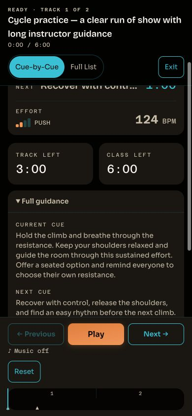

# Integrated UX audit — 2026-10-09

Candidate `8023d74baeb0b42b6e603a8678c1b63a382e1f85`, based on Builder main `be6d71a`, now represented by #504 squash `0ec1d10` with an identical file tree. The native Chrome journey used the actual components and stylesheet with synthetic local data and mocked APIs. No provider audio or production data was used.

Builder's closed/open Class details, rename Cancel focus, and visible Playback order passed. Live's closed/open Full guidance passed at 1280×800, 390×844, 320×568, 844×390, and 600×304 CSS viewports: both page and Live-shell overflow were zero, summaries were 44px, and full current/next text was retained. Full List kept focus, view switching reset the disclosure, a sparse track omitted it, and Exit restored the Builder with Class details closed. All 17 retained result records passed; no console errors were observed.

This integration audit used viewport emulation. Earlier independent lane records separately verified actual 200% Chrome zoom at 600×304 CSS pixels. These checks do not establish authenticated provider behavior, natural class completion, real-device behavior, or audible acceptance.

