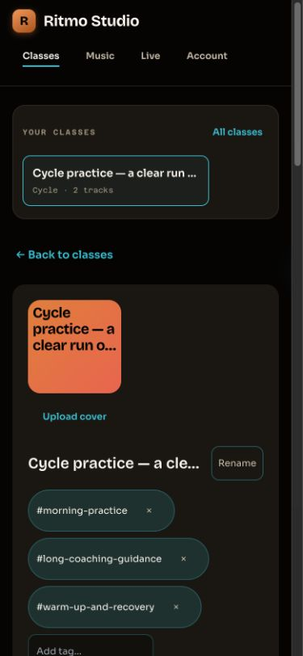
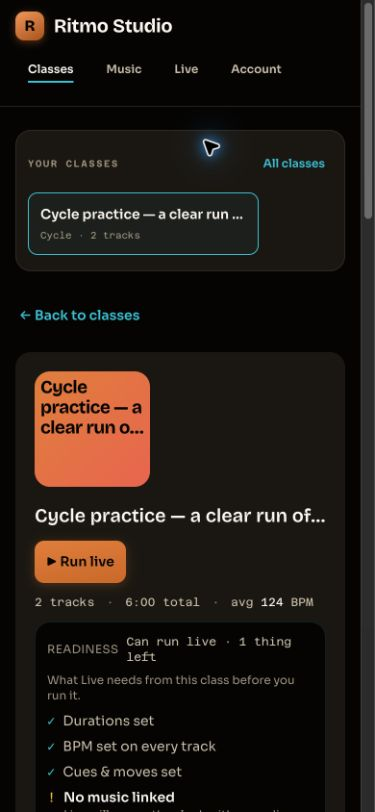

# Builder clarity — local verification

Base: `aade146d7a1f1c42c4065c51faab36be3f3d7ed5`. `manifest.json` binds the checked source and retained artifacts by SHA-256.

Synthetic instructor/class, tracks, cues, and notes were injected into a local component harness using mocked API responses. No production account, provider SDK audio, credentials, or real instructor data was used. All screenshots show the existing components and stylesheet served by Vite; the baseline uses unchanged main and the after images use this lane's worktree.

Responsive Chrome checks: desktop, 390x844, 320x568, 844x390, and 600x304 CSS pixels. Closed/open disclosures had no horizontal overflow, including the fixed Live shell. Disclosure summaries measured 44px. Native Chrome zoom was independently set to 200%; actual viewport measured 600x304 CSS pixels at devicePixelRatio 4 with viewport emulation reset. Temporary browser zoom, viewport overrides, and window size were restored afterward.

The full repository gate passed every step; see `gate-results.json`. Source was unchanged after the final passing gate. OpenAPI regeneration had no diff and contract parity passed. Dependency audit passed with the existing two ignored advisories (one low, one moderate).

Builder checks confirmed management discoverability, rename/tag draft retention, Rename focus after Escape, delete confirmation reset, and focus remaining in Add tag after a delayed rename response. Header height fell from 604 to 503 pixels at desktop and from 1020 to 723 pixels at 390px in the matched synthetic class. The playback-order list stays visible. Full unit counts: web 1063, API 486, music 30; integration 184.

Each lane passed independently. Combined-tree CI remains owed after authorized publication and sequential integration. These UI checks establish no audible playback or production acceptance.

