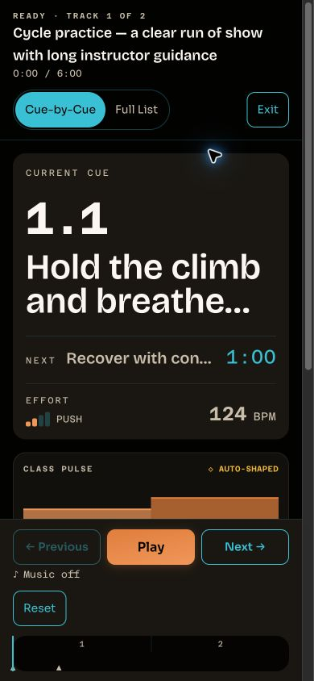
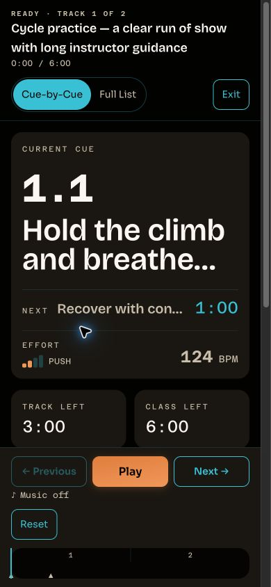

# Live clarity — local verification

Base: `aade146d7a1f1c42c4065c51faab36be3f3d7ed5`. `manifest.json` binds the checked source and retained artifacts by SHA-256.

Synthetic instructor/class, tracks, cues, and notes were injected into a local component harness using mocked API responses. No production account, provider SDK audio, credentials, or real instructor data was used. All screenshots show the existing components and stylesheet served by Vite; the baseline uses unchanged main and the after images use this lane's worktree.

Responsive Chrome checks: desktop, 390x844, 320x568, 844x390, and 600x304 CSS pixels. Closed/open disclosures had no horizontal overflow, including the fixed Live shell. Disclosure summaries measured 44px. Native Chrome zoom was independently set to 200%; actual viewport measured 600x304 CSS pixels at devicePixelRatio 4 with viewport emulation reset. Temporary browser zoom, viewport overrides, and window size were restored afterward.

The full repository gate passed every step; see `gate-results.json`. Source was unchanged after the final passing gate. OpenAPI regeneration had no diff and contract parity passed. Dependency audit passed with the existing two ignored advisories (one low, one moderate).

Live checks confirmed full current/next strings and preserved line breaks, timers ahead of Class Pulse, notes outside disclosure, keyboard toggling, Full List focus, disclosure reset on view switching, and omission on a sparse track. Focused tests additionally verify progress-driven updates, sparse/gap focus restoration, unrelated focus, and urgent recovery priority. Full unit counts: web 1060, API 486, music 30; integration 184.

Each lane passed independently. The later combined-tree CI passed on `8023d74` (run [37895737330](https://github.com/steven-crosby/ritmofit-web/actions/runs/37895737330)); #504 squash-merged as `0ec1d10` with the same file tree. These UI checks establish no audible playback or production acceptance.

Current publication/merge state supersedes the original verification checkpoint. Both UX PRs are merged. The [fresh integrated audit](../integration-audit/README.md) retains page and Live-shell overflow fields for open as well as closed states. Production remains the #494 baseline; natural provider/listening acceptance remains open.
